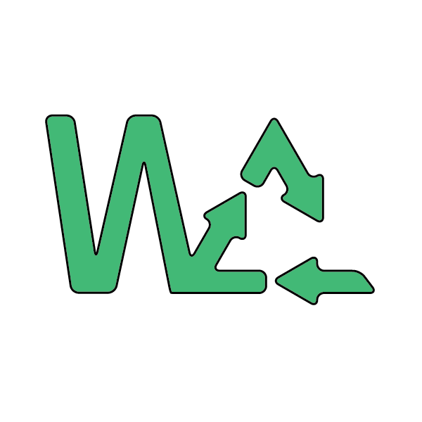

 

  

  

    
    
  

  <h1 align="center">WasteCreative Project</h1>

  

    Detection of household waste that has the potential to be a Creative Product
    <!--   -->
    <!-- <a href="https://github.com/github_username/repo_name"><strong>Explore the Projects »</strong></a> -->
     
     
    <strong>Our Project List</strong>
     
    
    
  

<!-- TABLE OF CONTENTS -->

  
<h2 style="display: inline-block">Table of Contents</h2>

  <ol>
    <li>
      <a href="#about-the-project">About The Project</a>
    </li>
    <li><a href="#team-members">Team Members</a></li>
    <li><a href="#our-projects-repository">Our Projects Repository</a></li>
    <li><a href="#our-products">Our Products</a>
    <ul>
      <li><a href="#prerequisites">Prerequisites</a></li>
      <li><a href="#android-apps">Android Apps</a></li>
      <li><a href="#api-documentations">API Documentations</a></li>
    </ul>
    </li>
    <li><a href="#acknowledgements">Acknowledgements</a></li>
  </ol>

## About The Project

Did you know, Based on data from the Ministry of Environment and Forestry (KLHK), 42.33% of waste in Indonesia comes from household activities. Household waste is the largest waste of the amount of waste generated. Household waste causes many negative impacts, it can cause illness that affect our wellbeing. It too can cause natural harm and contamination. Since all of that, it'll in the long run have an affect on social life of the community

Based on these problems, we are curious, how can we reduce the amount of household waste generated? Then we thought of a solution to create an android application that can help reduce the amount of household waste generated, namely WasteCreative. WasteCreative is an android application that can detect household waste objects and suggest crafts that can be made based on the detection results. We will also create a marketplace for buying and selling user-generated crafts. Besides being able to reduce the amount of household waste, this application also has the potential to help raise MSMEs in the creative industry welfare. This is the reason why we want to solve this problem.

## Team Members

|         Member               | Student ID   |        Path        |                Project Role                |
| :--------------------------: | :----------: | :----------------: | :----------------------------------------: | 
|   Muhammad Afrizal Miqdad    |  M2247J2184  |  Machine Learning  |         Machine Learning Engineer          |  
|       Ahmad Nurokhim         |  M2269J2329  |  Machine Learning  |         Machine Learning Engineer          |     
|        Nurul Hikmah          |  M7247J2177  |  Machine Learning  |         Machine Learning Engineer          | 
|     M.Gentha Arya Pratama    |  A2007F0710  | Mobile Development |             Mobile Developer               | 
|  Muhammad Ardhy Satrio Jati  |  A7247J2183  | Mobile Development |             Mobile Developer               | 
|     Nanda Afdlolul Basyar    |  C2332F2859  |  Cloud Computing   |                   DevOps                   | 

## Our Projects Repository

- [WasteCreative Android Apps](https://github.com/kadabengarann/waste-creative)
- [WasteCreative Object Detection Algorithm](https://github.com/ahmadnurokhim/WasteCreative)
- [WasteCreative API](https://github.com/nandaafd/wastecreative)

### Prerequisites

- Android 5.0 Lolipop
- Internet Connection
- Location Services

### API Documentations

We build Rest API for application purposes. Such as looking for craft references, providing craft recommendations from detection results, managing craft data (Create, Read, Update, and Delete), and managing marketplace data (Create, Read, Update, and Delete)

## Features of This Projects

1. Funcionality
   - Register
   - Login
   - Setting Profile
   - Viewing User Profile
   - Viewing other User's Profile
   - Carry out waste detection
   - View recommendations from detection results
   - Uploading crafts
   - Viewing other users' craft uploads
   - Giving likes to other users' craft uploads
   - Commenting on other users' craft uploads
   - Uploading products on the marketplace
   - See other users' products in the marketplace
   - Giving likes to other users' products in the marketplace
   - Comment on other users' products in the marketplace

2. Non Funcionality
   - The application can run smoothly up to 100 concurrent users
   - Application only runs on Android OS
   - The process of detecting and recommending crafts that can be made in less than 10 seconds
   - The system can be accessed in any area in Indonesia
   - The system can only be accessed if connected to the internet
   - The system has a user-friendly interface
   - The system can guarantee the security of user data

## Acknowledgements

  </img>&nbsp; &nbsp;

